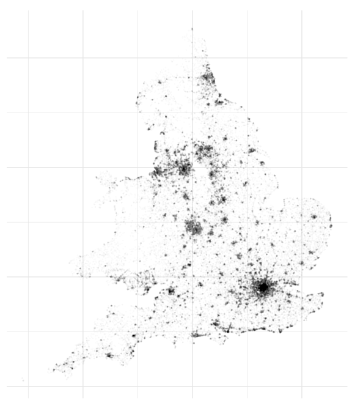
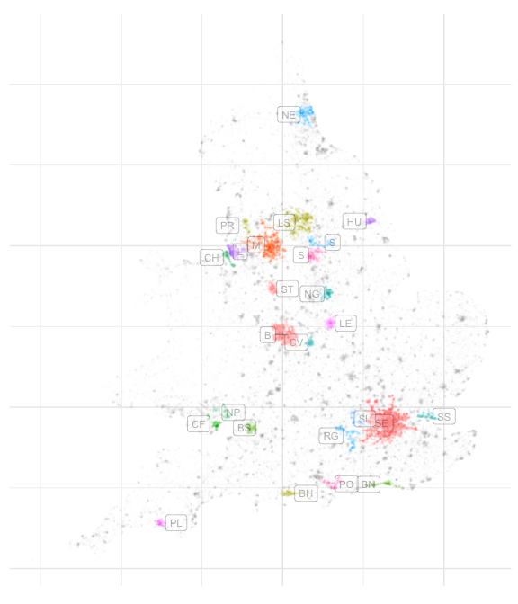

Mapping and dbscan
================

``` r
library(data.table)
library(dplyr)
library(ggplot2)
library(ggrepel)
library(dbscan)
```

nspl file from geoportal
------------------------

Use all residential postcodes to check methods for user/customer data

``` r
nspl <- fread("NSPL_FEB_2019_UK.csv", showProgress = FALSE)

nspl <-
  nspl %>%
  filter(is.na(doterm),
         usertype == 0,
         substr(ctry, 1, 1) %in% c("E", "W")) %>%
  select(pcds, ctry, oseast1m, osnrth1m, lat, long) %>%
  mutate(pcd_out = sub("[0-9]+", "", sub("\\s.+", "", pcds)))
```

Simple map of a sample of postcodes

``` r
ggplot(data = nspl[sample(nrow(nspl), 100000), ],
       aes(x = oseast1m, y = osnrth1m)) +
  coord_fixed() +
  geom_point(alpha = 0.01, size = 0.3) +
  theme_minimal() +
  theme(axis.text.x = element_blank(),
        axis.text.y = element_blank()) +
  labs(x = NULL, y = NULL)
```



clustering via dbscan
---------------------

Can explore sensitivity to eps (distance)

``` r
dbs <- dbscan(as.matrix(nspl[c("oseast1m", "osnrth1m")]),
              eps = 500, minPts = 10)
```

``` r
nspl <- mutate(nspl, cluster = dbs$cluster)
```

Summary of clusters including majority postcode area

``` r
(cluster_summary <-
  nspl %>%
  group_by(cluster) %>%
  filter(cluster > 0) %>%
  summarise(pcd_out = head(names(sort(-table(pcd_out))), 1),
            n = n(),
            oseast1m = mean(oseast1m),
            osnrth1m = mean(osnrth1m)) %>%
  arrange(desc(n)))
```

    ## # A tibble: 6,226 x 5
    ##    cluster pcd_out      n oseast1m osnrth1m
    ##      <int> <chr>    <int>    <dbl>    <dbl>
    ##  1       1 SE      196603  528347.  180652.
    ##  2     179 M        75134  381220.  401261.
    ##  3     206 LS       48973  419883.  429153.
    ##  4      16 B        48933  402538.  289758.
    ##  5    1254 NE       23019  427684.  562952.
    ##  6    2481 L        19544  340916.  392909.
    ##  7    1971 RG       16129  481302.  164518.
    ##  8     324 BS       15333  360555.  174563.
    ##  9    4614 S        14466  438353.  388514.
    ## 10    1235 NG       13368  454664.  340506.
    ## # … with 6,216 more rows

Map largest clusters by population

``` r
clust_n <- 25

sample_cluster <-
  nspl %>% 
  filter(cluster %in% head(cluster_summary$cluster, clust_n)) %>%
  sample_n(40000)

sample_remain  <-
  nspl %>% 
  filter(cluster %in% head(cluster_summary$cluster, clust_n) == FALSE) %>%
  sample_n(60000)
  

ggplot(sample_remain,
       aes(x = oseast1m, y = osnrth1m)) +
  coord_fixed() +
  geom_point(colour = "grey", alpha = 0.01, size = 0.3) +
  geom_point(data = sample_cluster,
             aes(colour = as.factor(cluster)),
             alpha = 0.01, size = 0.3) +
  geom_label_repel(data = cluster_summary[1:clust_n, ],
                   aes(label = pcd_out),
                   size = 3, alpha = 0.3, direction = "x") +
  theme_minimal() +
  theme(axis.text.x = element_blank(),
        axis.text.y = element_blank(),
        legend.position = "none") +
  labs(x = NULL, y = NULL) 
```


