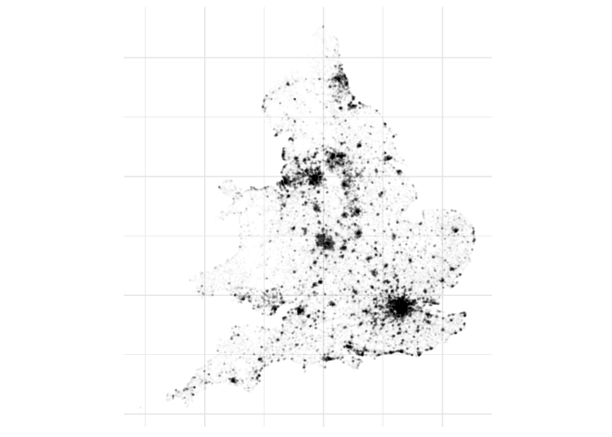

Mapping and dbscan
================

``` r
library(data.table)
library(dplyr)
library(ggplot2)
library(dbscan)
```

``` r
nspl <- fread("NSPL_FEB_2019_UK.csv", showProgress = FALSE)

nspl <-
  nspl %>%
  filter(is.na(doterm),
         usertype == 0,
         substr(ctry, 1, 1) %in% c("E", "W")) %>%
  select(pcds, ctry, oseast1m, osnrth1m, lat, long)
```

``` r
ggplot(data = nspl[sample(nrow(nspl), 100000), ],
       aes(x = oseast1m, y = osnrth1m)) +
  coord_fixed() +
  geom_point(alpha = 0.01, size = 0.3) +
  theme_minimal() +
  theme(axis.text.x = element_blank(),
        axis.text.y = element_blank()) +
  labs(x = NULL, y = NULL)
```


